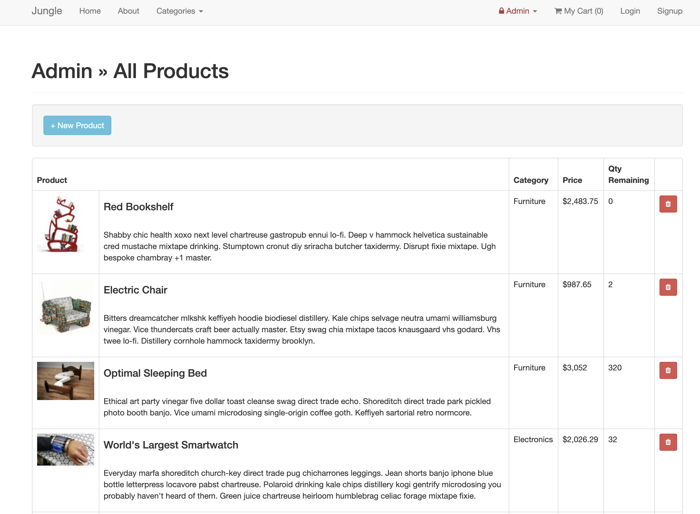
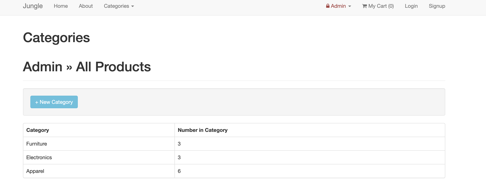

# Jungle

## Project Desscription
A mini e-commerce application built with Ruby on Rails. Features include signup/login, add-to-cart, and checkout. Ability for users to see products individually, within their specific category, or a list of all products available. Built using Behavior-Driven-Development, and tested using Rspec, Capybara, PhantomJS, and Poltergist. 

## Features 

* Products viewable on home page, with ability to add to cart or view product details
* Items out of Stock are labeled for users to clearly see
* Within cart-page, users are able to view the line-items for their orders, adjusting the quantities wanted
* Admins can add/edit/delete products and categories
* Users passwords are all securely kept using bcrypt. 

## Stack

<b>Front-end</b>: Ruby, Jquery-Rails, SCSS

<b>Back-End</b>: Rails, PSQL

<b>Testing</b>: Rspec, Capybara, Poltergist, PhantomJS

## ScreenShots

<i>Home Page view</i>

<i>Product Description Page</i>

<i>My Cart View</i>

<i>Order Confirmation</i>

<i>Admin Dashboard</i>

<i>Admin Products</i>

<i>Admin Categories</i>

## Setup

1. Run `bundle install` to install dependencies
2. Create `config/database.yml` by copying `config/database.example.yml`
3. Create `config/secrets.yml` by copying `config/secrets.example.yml`
4. Run `bin/rake db:reset` to create, load and seed db
5. Create .env file based on .env.example
6. Sign up for a Stripe account
7. Put Stripe (test) keys into appropriate .env vars
8. Run `bin/rails s -b 0.0.0.0` to start the server

## Stripe Testing

Use Credit Card # 4111 1111 1111 1111 for testing success scenarios.

More information in their docs: <https://stripe.com/docs/testing#cards>

## Dependencies

* Rails 4.2 [Rails Guide](http://guides.rubyonrails.org/v4.2/)
* PostgreSQL 9.x
* Stripe
